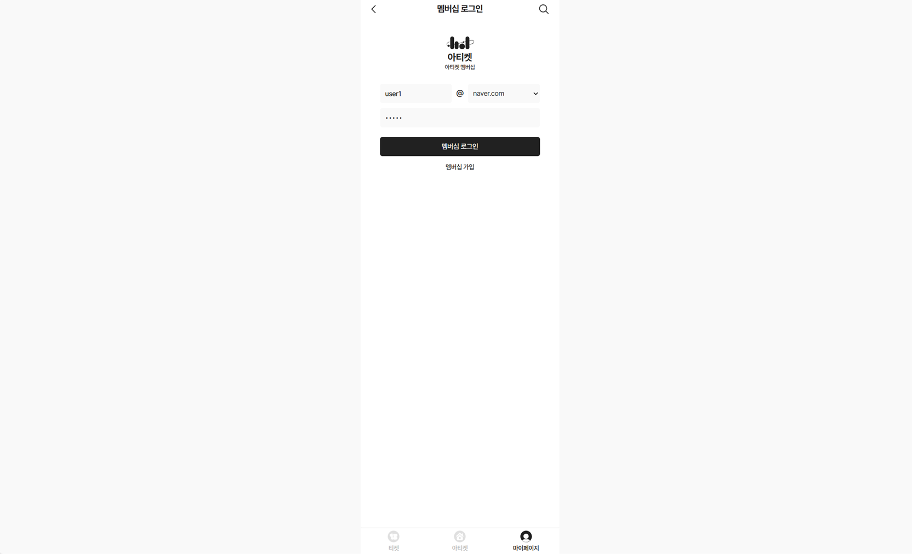
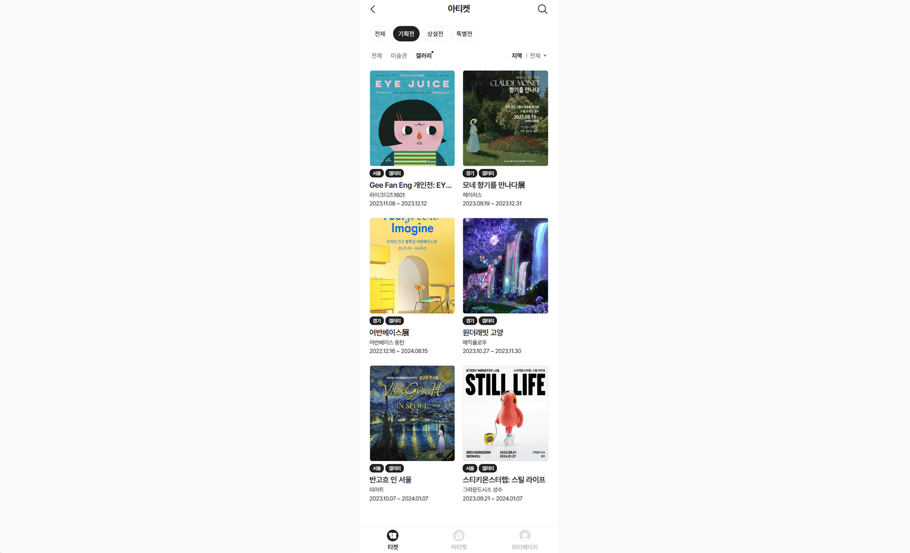
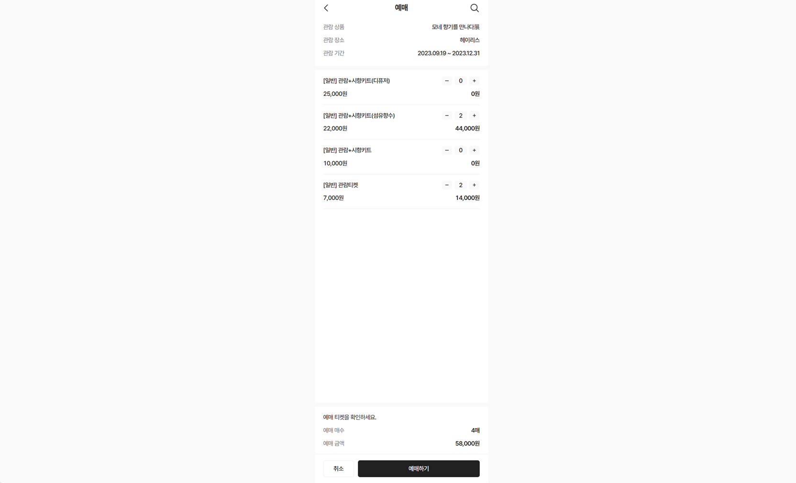

<div align="center">
  <h1>전시회 티켓 예매 웹 애플리케이션</h1>
</div>

<div align="center">
  
  
  
  
  
  <br>
  
  
  
  
</div>
<br>

<div align="left">
  <h2>1. 개발 환경</h2>

- <p><b>OS: </b>Windows (11, 64 Bit)</p>
- <p><b>DB: </b>Maria DB</p>
- <p><b>IDE: </b>IntelliJ</p>
</div>
<br>

<div align="left">
  <h2>2. 실행 화면</h2>








</div>
<br>

<div align="left">
  <h2>3. 프로젝트 구조</h2>

  ```
  *
  ├─ app.api/**: 회원/티켓/예매 관련 컨트롤러 클래스
  ├─ app.core/**: 회원/티켓/예매 관련 도메인/서비스 클래스
  ├─ app.dummy/**: 초기 데이터 설정 클래스
  ├─ app.share/**: 공통 설정 클래스
  │
  ├─ src/resources/data/**: 초기 데이터 파일(티켓 이미지)
  ├─ src/resources/static/**: 웹 페이지 파일(CSS, JS)
  └─ src/resources/template/**: 웹 페이지 파일(Thymeleaf)
  ```
</div>
<br>

<div align="left">
  <h2>4. 구현 기능</h2>

#### 1) 회원
- 회원 등록, 마이페이지, 로그인/로그아웃
#### 2) 티켓
- 티켓 상세 조회 및 목록 조회

  ```
  상세 조회: 가격 안내, 관람 후기, 장소 안내 탭으로 구분하여 구현하였다.
  목록 조회: 장소/티켓 카테고리를 선택하여 볼 수 있도록 구현하였다.
  ```
#### 3) 티켓 예매
- 티켓 예매 및 예매 내역 조회, 예매 상태 변경

  ```
  예매: 사용자가 선택한 티켓 옵션별 매수/금액으로 합계 매수/금액을 산출하였다.
  예매 내역 조회: 예매 상태별 탭을 선택하여 볼 수 있도록 구현하였다.
  예매 상태 변경: 이용 완료/예매 취소 버튼으로 상태를 변경할 수 있다.
  ```
#### 4) 관람 후기
- 평균 평점, 관람 후기 목록 조회

  ```
  관람 후기 등록: 평점을 선택하고 내용을 작성할 수 있도록 구현하였다.
  ```
</div>